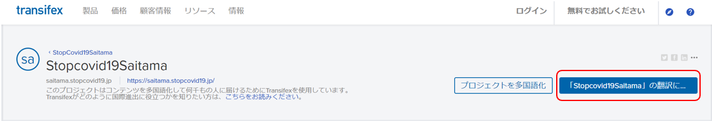
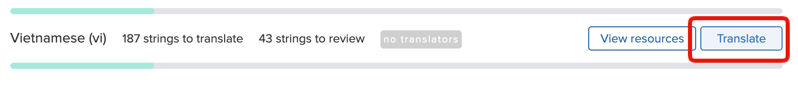
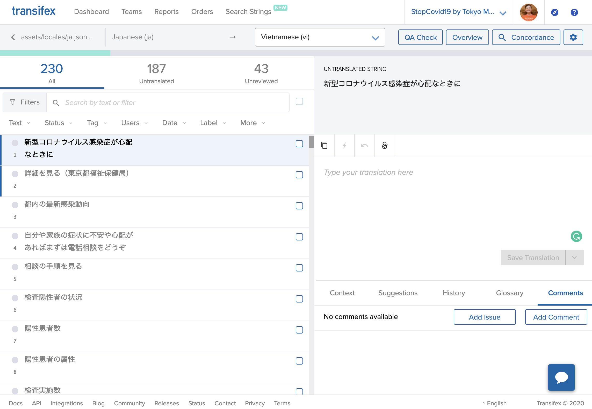

# How to contribute translations

We are using Transifex to manage the resources that are used by internationalized content.

## For contributors of translations

Please go to our project page on the Transifex.
https://www.transifex.com/stopcovid19-saitama/stopcovid19Saitama/

Please join our team from `Help Translate "stopcovid19Saitama"` button. You will need to make/login account before joining our team.

After joining, please go to the dashboard page.

https://www.transifex.com/stopcovid19-saitama/stopcovid19Saitama/dashboard/

Press `Translate` button on the language resource that you want to contribute.

You will see the translation editor. Search the text you want to translate from the left pane, then enter the translated text in the text area on the right pane.

After editing, please press `Save Translation` button. 

After the translation completed, the dev team will update the language resources with latest texts.

Transifex has some useful features like a dictionary feature. Feel free to use it if it is useful. Any suggestions are welcome!

## Adding new language

If you want to add new language. Please request new language via Transifex system. However, we may not accept every languages due to reviewing capacity limit.
